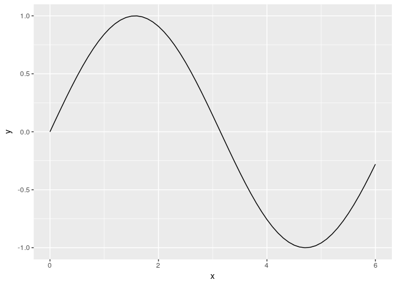
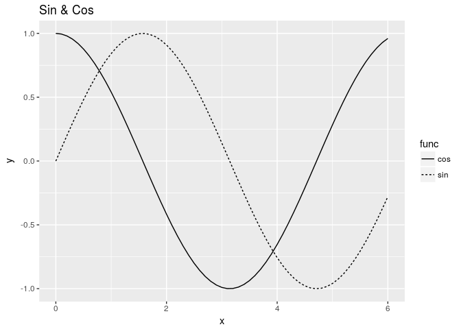

Introduction to R, and some remarks on differences from Python
================

This chapter corresponds to "Introruction to Python" in the [original book](https://github.com/oreilly-japan/deep-learning-from-scratch).

Data types
----------

We will use `class` function to know the variable types. Notice that type of `10` is `numeric` not `integer`. Append `L` to make it treated as an integer.

``` r
class(10)
```

    ## [1] "numeric"

``` r
class(10L)
```

    ## [1] "integer"

``` r
class(2.718)
```

    ## [1] "numeric"

``` r
class("hello")
```

    ## [1] "character"

Variables
---------

Like Python, R also supports dynamic typing.

``` r
x <- 100L
y <- 3.14
x*y
```

    ## [1] 314

``` r
class(x*y)
```

    ## [1] "numeric"

List and vectors
----------------

For basic types such as numeric and character, we can make a vector by `c` function. R uses one-base indexing (index starts with 1, not 0).

``` r
a <- c(1,2,3,4,5)
a
```

    ## [1] 1 2 3 4 5

``` r
length(a)
```

    ## [1] 5

``` r
a[1]
```

    ## [1] 1

``` r
a[5]
```

    ## [1] 5

``` r
a[5] <- 99
a
```

    ## [1]  1  2  3  4 99

What is more similar to python's list would be `list`, since it can have different types of elements. Use `[[` to access list elements.

``` r
a <- list(1,2,3,4,5)
a
```

    ## [[1]]
    ## [1] 1
    ## 
    ## [[2]]
    ## [1] 2
    ## 
    ## [[3]]
    ## [1] 3
    ## 
    ## [[4]]
    ## [1] 4
    ## 
    ## [[5]]
    ## [1] 5

``` r
length(a)
```

    ## [1] 5

``` r
a[[1]]
```

    ## [1] 1

``` r
a[[5]]
```

    ## [1] 5

``` r
a[[5]] <- 99
a
```

    ## [[1]]
    ## [1] 1
    ## 
    ## [[2]]
    ## [1] 2
    ## 
    ## [[3]]
    ## [1] 3
    ## 
    ## [[4]]
    ## [1] 4
    ## 
    ## [[5]]
    ## [1] 99

Dictionary, and hash table
--------------------------

Vectors of lists can have names, with which we can use them like a dictionary.

``` r
## Vector 
me <- c(height = 180)
me["height"]
```

    ## height 
    ##    180

``` r
me["weight"] <- 70
me
```

    ## height weight 
    ##    180     70

``` r
## List 
me <- list(height = 180)
me[["height"]]
```

    ## [1] 180

``` r
me[["weight"]] <- 70
me
```

    ## $height
    ## [1] 180
    ## 
    ## $weight
    ## [1] 70

Alternatively, we can use `hash` function from `hash` library.

``` r
library(hash)
```

    ## hash-2.2.6 provided by Decision Patterns

``` r
me <- hash(height = 180)
me$height
```

    ## $height
    ## [1] 180

``` r
me$weight <- 70
me
```

    ## <hash> containing 2 key-value pair(s).
    ##   height : 180
    ##   weight : 70

Boolean or logicals
-------------------

In R, boolean variables called `logical` and have values `TRUE` or `FALSE`.

``` r
hungry <- TRUE
sleepy <- FALSE
class(hungry)
```

    ## [1] "logical"

``` r
!hungry
```

    ## [1] FALSE

``` r
hungry & sleepy
```

    ## [1] FALSE

``` r
hungry | sleepy
```

    ## [1] TRUE

If-statement
------------

``` r
hungry <- TRUE
if (hungry) print("I'm hungry")
```

    ## [1] "I'm hungry"

``` r
hungry <- FALSE
if (hungry) {
  print("I'm hungry")
} else {
  print("I'm not hungry")
  print("I'm sleepy")
}
```

    ## [1] "I'm not hungry"
    ## [1] "I'm sleepy"

For loop
--------

``` r
for (i in 1:3) print(i)
```

    ## [1] 1
    ## [1] 2
    ## [1] 3

Functions
---------

``` r
hello <- function()
{
  print("Hello World!")
}
hello()
```

    ## [1] "Hello World!"

``` r
hello <- function(object)
{
  print(sprintf("Hello %s!", object))
}
hello("cat")
```

    ## [1] "Hello cat!"

Script File
-----------

To run a script file from R session, use `source` function.

``` r
source("hungry.R")
```

    ## [1] "I'm hungry!"

To run a script file from console, call `Rscript`.

``` bash
$ Rscript hungry.R 
[1] "I'm hungry!"
```

Class
-----

R has various ways to define classes. In this exercise, we will use [`R6`](https://cran.r-project.org/web/packages/R6/vignettes/Introduction.html) implementation. See more about object oriented programming in R, see [Hadley's Advanced R](http://adv-r.had.co.nz/OO-essentials.html).

``` r
library(R6)
Man <- R6Class(
  "Man",
  public = list(
    name = "",
    initialize = function(name) { self$name <- name },
    hello = function() { print(sprintf("Hello %s!", self$name))  },
    goodbye = function()  { print(sprintf("Gooe-bye %s!", self$name)) }
  )
)

m <- Man$new("David")
m$hello()
```

    ## [1] "Hello David!"

``` r
m$goodbye()
```

    ## [1] "Gooe-bye David!"

Matrix and array
----------------

What's similar to numpy's arrays in R is `vector` (1d), `matrix` (2d) and `array` (3d+).

``` r
x <- c(1,2,3)
y <- c(2,4,6)
x+y
```

    ## [1] 3 6 9

``` r
x*y
```

    ## [1]  2  8 18

``` r
x/y
```

    ## [1] 0.5 0.5 0.5

``` r
x/2
```

    ## [1] 0.5 1.0 1.5

``` r
A <- matrix(c(1,2,3,4), nrow=2, ncol=2, byrow=TRUE)
A
```

    ##      [,1] [,2]
    ## [1,]    1    2
    ## [2,]    3    4

``` r
dim(A)
```

    ## [1] 2 2

``` r
B <- matrix(c(3,0,0,6), nrow=2, ncol=2, byrow=TRUE)
A+B
```

    ##      [,1] [,2]
    ## [1,]    4    2
    ## [2,]    3   10

``` r
A*B
```

    ##      [,1] [,2]
    ## [1,]    3    0
    ## [2,]    0   24

``` r
A*10
```

    ##      [,1] [,2]
    ## [1,]   10   20
    ## [2,]   30   40

Broadcast
---------

R's broadcast rule is the opposite of that of python.

``` r
A <- matrix(c(1,2,3,4), nrow=2, ncol=2, byrow=TRUE)
B <- c(10,20)
A*B
```

    ##      [,1] [,2]
    ## [1,]   10   20
    ## [2,]   60   80

``` r
# to reproduce the book's result,
A <- matrix(c(1,2,3,4), nrow=2, ncol=2, byrow=FALSE)
B <- c(10,20)
t(A*B)
```

    ##      [,1] [,2]
    ## [1,]   10   40
    ## [2,]   30   80

Array
-----

``` r
x <- array(1, dim=c(4,3,2))
x
```

    ## , , 1
    ## 
    ##      [,1] [,2] [,3]
    ## [1,]    1    1    1
    ## [2,]    1    1    1
    ## [3,]    1    1    1
    ## [4,]    1    1    1
    ## 
    ## , , 2
    ## 
    ##      [,1] [,2] [,3]
    ## [1,]    1    1    1
    ## [2,]    1    1    1
    ## [3,]    1    1    1
    ## [4,]    1    1    1

``` r
y <- 1:8
x*y
```

    ## , , 1
    ## 
    ##      [,1] [,2] [,3]
    ## [1,]    1    5    1
    ## [2,]    2    6    2
    ## [3,]    3    7    3
    ## [4,]    4    8    4
    ## 
    ## , , 2
    ## 
    ##      [,1] [,2] [,3]
    ## [1,]    5    1    5
    ## [2,]    6    2    6
    ## [3,]    7    3    7
    ## [4,]    8    4    8

Access matrix/array elements
----------------------------

``` r
X <- matrix(c(51,55,14,19,0,4), nrow=3, ncol=2, byrow=TRUE)
X
```

    ##      [,1] [,2]
    ## [1,]   51   55
    ## [2,]   14   19
    ## [3,]    0    4

``` r
X[1,]
```

    ## [1] 51 55

``` r
X[1,2]
```

    ## [1] 55

``` r
for (i in 1:nrow(X)) print(X[i,])
```

    ## [1] 51 55
    ## [1] 14 19
    ## [1] 0 4

Elements are tracked by "column" first way in R. So flattening behavior is different from Python.

``` r
dim(X) <- prod(dim(X))
X
```

    ## [1] 51 14  0 55 19  4

``` r
# to reproduce the book result,
X <- matrix(c(51,55,14,19,0,4), nrow=3, ncol=2, byrow=FALSE)
dim(X) <- prod(dim(X))
X
```

    ## [1] 51 55 14 19  0  4

``` r
X[c(1,3,5)]
```

    ## [1] 51 14  0

``` r
X > 15
```

    ## [1]  TRUE  TRUE FALSE  TRUE FALSE FALSE

``` r
X[X > 15]
```

    ## [1] 51 55 19

Plot
----

R has various ways to visualize data. In this exercise, we will use `ggplot2` library.

``` r
library(ggplot2)
x <- seq(0, 6, 0.1)
y <- sin(x)
qplot(x, y, geom="line")
```



``` r
y1 <- sin(x)
y2 <- cos(x)
tmp <- rbind(data.frame(x=x, y=y1, func="sin", stringsAsFactors=FALSE),
             data.frame(x=x, y=y2, func="cos", stringsAsFactors=FALSE))
ggplot(tmp, aes(x, y, linetype=func)) + geom_line() + ggtitle("Sin & Cos")
```



Image plot
----------

To read a png format image file, use `readPNG` from `png` library. It is loaded as a 3d array of shape `(nrow, ncol, channel)`. To visualize image, we can use `grid.raster` from `grid` library.

``` r
library(png)
img <- readPNG("../dataset/lena.png")
str(img)
```

    ##  num [1:256, 1:256, 1:3] 0.875 0.882 0.89 0.89 0.878 ...

``` r
library(grid)
grid.raster(img)
```


`grid.raster` does not return graphic object. To use image plot as if it is a `ggplot` objects, we will use the following custom function.

``` r
image_plot <- function(arr)
{
  out <- grid::rasterGrob(arr)

  out <- ggplot2::qplot(0.5, 0.5, xlim=c(0,1), ylim=c(0,1)) +
    ggplot2::theme_void() + ggplot2::xlab('') + ggplot2::ylab('') +
    ggplot2::annotation_custom(out)

  out
}
image_plot(img)
```


``` r
class(image_plot(img))
```

    ## [1] "gg"     "ggplot"
