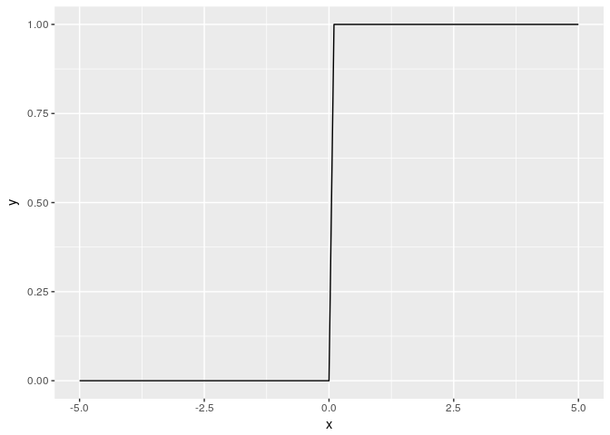
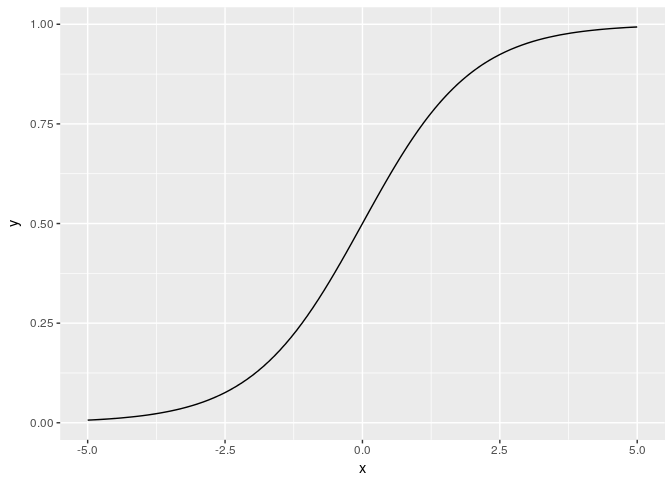
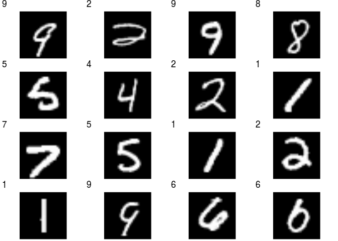
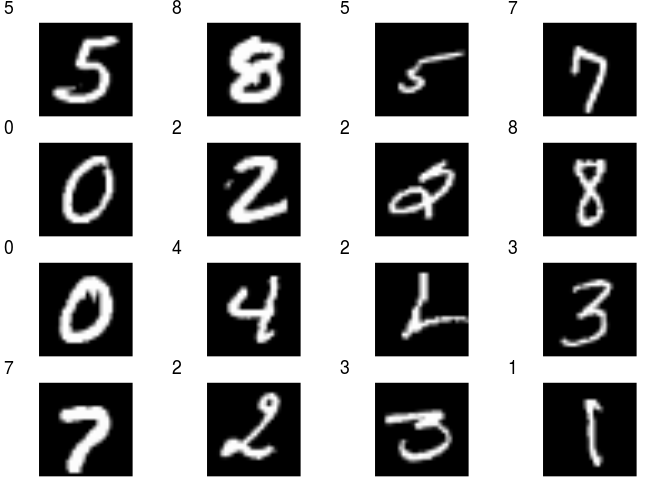

Neural Network
================

This chapter corresponds to Chapter 3, "Neural Network" in the [original book](https://github.com/oreilly-japan/deep-learning-from-scratch).

Activation functions
--------------------

### Step function

``` r
library(ggplot2)
step_func <- function(a) { as.integer(a > 0) }

x <- seq(-5, 5, 0.1)
y <- step_func(x)
qplot(x, y, geom="line")
```



### Sigmoid function

``` r
sigmoid <- function(a) { 1 / (1 + exp(-a)) }

x <- c(-1, 1, 2)
sigmoid(x)
```

    ## [1] 0.2689414 0.7310586 0.8807971

``` r
x <- seq(-5, 5, 0.1)
y <- sigmoid(x)
qplot(x, y, geom="line")
```



### Rectified Linear Unit (ReLU)

``` r
relu <- function(a) { pmax(0, a) }

x <- seq(-5, 5, 0.1)
y <- relu(x)
qplot(x, y, geom="line")
```


Array manipulation
------------------

Python's `shape` corresponds to R's `dim` function. There is no `ndim` counterpart in R; Use `length(dim(A))`. We use `array` instead of `c` to make a 1d-array. Doing so we can apply `dim` function.

``` r
A <- array(1:4)
length(dim(A))
```

    ## [1] 1

``` r
dim(A)
```

    ## [1] 4

``` r
B <- matrix(c(1:6), nrow=3, ncol=2, byrow=TRUE)
B
```

    ##      [,1] [,2]
    ## [1,]    1    2
    ## [2,]    3    4
    ## [3,]    5    6

``` r
length(dim(B))
```

    ## [1] 2

``` r
dim(B)
```

    ## [1] 3 2

### Dot product

Dot product is calculated by the `%*%` operator.

``` r
A <- matrix(1:4, nrow=2, ncol=2, byrow=TRUE)
dim(A)
```

    ## [1] 2 2

``` r
B <- matrix(5:8, nrow=2, ncol=2, byrow=TRUE)
dim(B)
```

    ## [1] 2 2

``` r
A %*% B
```

    ##      [,1] [,2]
    ## [1,]   19   22
    ## [2,]   43   50

``` r
A <- matrix(1:6, nrow=2, ncol=3, byrow=TRUE)
dim(A)
```

    ## [1] 2 3

``` r
B <- matrix(1:6, nrow=3, ncol=2, byrow=TRUE)
dim(B)
```

    ## [1] 3 2

``` r
A %*% B
```

    ##      [,1] [,2]
    ## [1,]   22   28
    ## [2,]   49   64

Also convenient would be `crossprod` and `tcrossprod` functions. `crossprod(A, b) = t(A) %*% B` and `tcrossprod(A, B) = A %*% t(B)`.

``` r
crossprod(t(A), B)
```

    ##      [,1] [,2]
    ## [1,]   22   28
    ## [2,]   49   64

``` r
tcrossprod(A, t(B))
```

    ##      [,1] [,2]
    ## [1,]   22   28
    ## [2,]   49   64

Size mismatch raises an error.

``` r
A <- matrix(1:6, nrow=2, ncol=3, byrow=TRUE)
dim(A)
```

    ## [1] 2 3

``` r
C <- matrix(1:4, nrow=2, ncol=2, byrow=TRUE)
dim(C)
```

    ## [1] 2 2

``` r
A %*% C
```

    ## Error in A %*% C: non-conformable arguments

### Dot products in neural network

``` r
X <- array(1:2)
dim(X)
```

    ## [1] 2

``` r
W <- matrix(1:6, nrow=2, ncol=3, byrow=FALSE)
W
```

    ##      [,1] [,2] [,3]
    ## [1,]    1    3    5
    ## [2,]    2    4    6

``` r
dim(W)
```

    ## [1] 2 3

``` r
X %*% W
```

    ##      [,1] [,2] [,3]
    ## [1,]    5   11   17

``` r
# or equivalently
crossprod(X, W)
```

    ##      [,1] [,2] [,3]
    ## [1,]    5   11   17

### Implementing 3-layer neural network

``` r
identity_func <- function(a) { a }

init_network <- function()
{
  list(W1 = array((1:6)/10, dim=c(2,3)),
       b1 = (1:3)/10,
       W2 = array((1:6)/10, dim=c(3,2)),
       b2 = c(0.1, 0.2),
       W3 = array((1:4)/10, dim=c(2,2)),
       b3 = c(0.1, 0.2))
}

forward <- function(network, x)
{
  if (is.vector(x)) x <- array(x, dim=c(1, length(x)))
  a1 <- x %*% network$W1 + network$b1
  z1 <- sigmoid(a1)
  a2 <- z1 %*% network$W2 + network$b2
  z2 <- sigmoid(a2)
  a3 <- z2 %*% network$W3 + network$b3
  y <- identity_func(a3)
  y
}

network <- init_network()
x <- c(1, 0.5)
y <- forward(network, x)
y
```

    ##           [,1]      [,2]
    ## [1,] 0.3168271 0.6962791

Output layer
------------

``` r
softmax <- function(a)
{
  C <- max(a)
  exp_a <- exp(a-C)
  exp_a / sum(exp_a)
}

a <- c(0.3, 2.9, 4.0)
y <- softmax(a)
y
```

    ## [1] 0.01821127 0.24519181 0.73659691

``` r
sum(y)
```

    ## [1] 1

MNIST
-----

Run scripts for defining the mnist data loader and image plot helper functions.

``` r
source("mnist.R")
source("helpers.R")
```

``` r
d <- load_mnist(normalize=TRUE, flatten=FALSE, one_hot_label=FALSE)
str(d)
```

    ## List of 4
    ##  $ train_img  : num [1:60000, 1:28, 1:28] 0 0 0 0 0 0 0 0 0 0 ...
    ##  $ train_label: int [1:60000] 5 0 4 1 9 2 1 3 1 4 ...
    ##  $ test_img   : num [1:10000, 1:28, 1:28] 0 0 0 0 0 0 0 0 0 0 ...
    ##  $ test_label : int [1:10000] 7 2 1 0 4 1 4 9 5 9 ...

``` r
random_plot(d$train_img, d$train_label)
```



``` r
random_plot(d$test_img, d$test_label)
```



### Convert pickled sample weights to R data

The original book provides pre-trained network weights in the GitHub repository [sample\_weight.pkl](https://raw.githubusercontent.com/oreilly-japan/deep-learning-from-scratch/master/ch03/sample_weight.pkl). The file needs to be converted R data format to be used in R.

To do so, first, use `savetxt` method of `numpy` to save weights in text files. The python script below creates six text files: `b1`, `b2`, `b3`, `W1`, `W2` and `W3`.

``` python
import numpy as np
import pickle
with open("sample_weight.pkl", "rb") as f:
    data = pickle.load(f)
for key in data:
    np.savetxt(key, data[key])
```

Then run the following command in R to make them into a R data file.

``` r
b1 <- scan("sample-weight/b1")
b2 <- scan("sample-weight/b2")
b3 <- scan("sample-weight/b3")

W1 <- read.table("sample-weight/W1", header=FALSE, sep=" ")
W2 <- read.table("sample-weight/W2", header=FALSE, sep=" ")
W3 <- read.table("sample-weight/W3", header=FALSE, sep=" ")
W1 <- as.matrix(W1)
W2 <- as.matrix(W2)
W3 <- as.matrix(W3)
dimnames(W1) <- NULL
dimnames(W2) <- NULL
dimnames(W3) <- NULL


out <- list(b1=b1, b2=b2, b3=b3, W1=W1, W2=W2, W3=W3)
saveRDS(out, "sample_weight.rds")
```

### Prediction with sample network weights

``` r
get_data <- function() 
{
  # load and return test data
  d <- load_mnist(normalize=TRUE, flatten=TRUE, one_hot_label=FALSE)
  d[c("test_img", "test_label")]
}

init_network <- function()
{
  # load and return network weights
  network <- readRDS("sample_weight.rds")
  network
}

prediction <- function(network, x)
{
  if (is.vector(x)) x <- array(x, dim=c(1, length(x)))
  a1 <- x %*% network$W1 + network$b1
  z1 <- sigmoid(a1)
  a2 <- z1 %*% network$W2 + network$b2
  z2 <- sigmoid(a2)
  a3 <- z2 %*% network$W3 + network$b3
  y <- softmax(a3)
  y
}

d <- get_data()
network <- init_network()
str(d)
```

    ## List of 2
    ##  $ test_img  : num [1:10000, 1:784] 0 0 0 0 0 0 0 0 0 0 ...
    ##  $ test_label: int [1:10000] 7 2 1 0 4 1 4 9 5 9 ...

``` r
str(network)
```

    ## List of 6
    ##  $ b1: num [1:50] -0.0675 0.0696 -0.0273 0.0226 -0.22 ...
    ##  $ b2: num [1:100] -0.01471 -0.07215 -0.00156 0.122 0.11603 ...
    ##  $ b3: num [1:10] -0.06024 0.00933 -0.0136 0.02167 0.01074 ...
    ##  $ W1: num [1:784, 1:50] -0.00741 -0.0103 -0.01309 -0.01001 0.02207 ...
    ##  $ W2: num [1:50, 1:100] -0.1069 0.2991 0.0658 0.0939 0.048 ...
    ##  $ W3: num [1:100, 1:10] -0.422 -0.524 0.683 0.155 0.505 ...

One-by-one prediction.

``` r
accuracy_count <- 0
for (i in 1:length(d$test_label))
{
  y <- prediction(network, d$test_img[i,])
  p <- which.max(y)-1L
  if (p == d$test_label[i]) accuracy_count <- accuracy_count + 1
}
cat("Accuracy:", accuracy_count/length(d$test_label), "\n")
```

    ## Accuracy: 0.9352

For batch prediction, we need to modify the softmax function to work for matrix input.

``` r
softmax <- function(a)
{
  # a : either numeric vector or matrix of size (N, classes)
  # 
  # returns: probability matrix of size (N, classes)
  
  if (is.vector(a)) dim(a) <- c(1, length(a))
  
  C <- max(a)
  exp_a <- exp(a-C)
  exp_a / rowSums(exp_a)
}
a <- matrix(c(3, 1, 2, 1, 2, 5), nrow=2, ncol=3, byrow=TRUE)
softmax(a)
```

    ##            [,1]       [,2]      [,3]
    ## [1,] 0.66524096 0.09003057 0.2447285
    ## [2,] 0.01714783 0.04661262 0.9362396

``` r
rowSums(softmax(a))
```

    ## [1] 1 1

Also, prediction function needs to revised due to the broadcasting rule of R.

``` r
prediction <- function(network, x)
{
  if (is.vector(x)) x <- array(x, dim=c(1, length(x)))
  x <- t(x)
  a1 <- crossprod(network$W1, x) + network$b1
  z1 <- sigmoid(a1)
  a2 <- crossprod(network$W2, z1) + network$b2
  z2 <- sigmoid(a2)
  a3 <- crossprod(network$W3, z2) + network$b3
  a3 <- t(a3)
  y <- softmax(a3)
  y
}
```

Batch prediction.

``` r
batch_size <- 100
accuracy_count <- 0
for (i in seq(1, length(d$test_label), batch_size))
{
  index <- i:min((i+batch_size-1), length(d$test_label)) 
  y <- prediction(network, d$test_img[index,])
  p <- apply(y, 1, which.max) - 1L  # one-base index
  accuracy_count <- accuracy_count + sum(p==d$test_label[index])
}
cat("Accuracy:", accuracy_count/length(d$test_label), "\n")
```

    ## Accuracy: 0.9352
